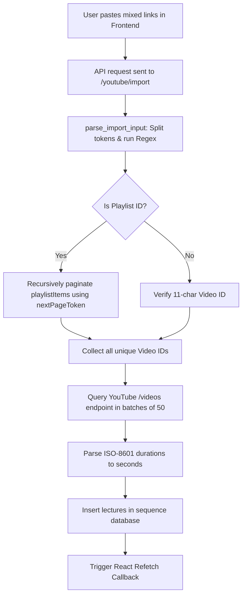
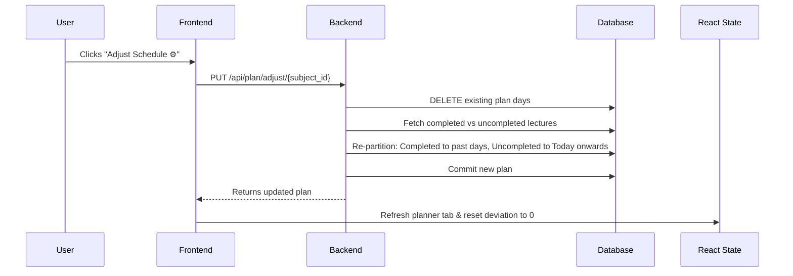
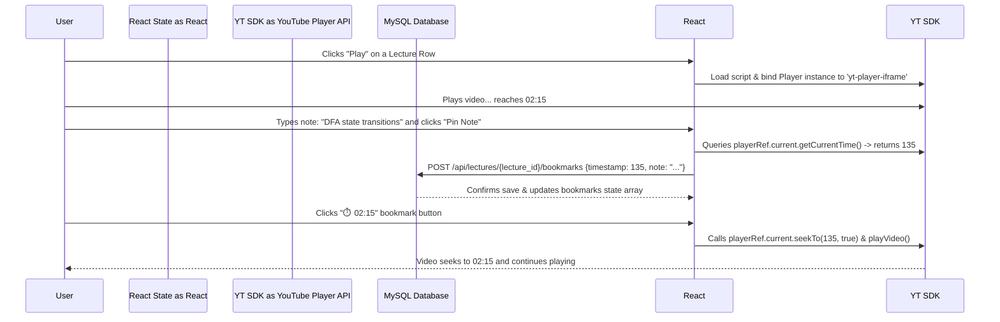

# Study Tracker: Core Application Logics, State Flows & Algorithms

This document provides a detailed breakdown of the algorithms, mathematical models, and architectural state transitions that power the Study Tracker application. It explains **why** each design decision was made, **how** the system behaves, and **what states** transition on both the backend and frontend.

---

## 1. YouTube Import & Video Parsing Logic
* **Backend Location:** [youtube_service.py](file:///c:/Users/User/Desktop/study-tracker2/study-tracker/backend/app/services/youtube_service.py)
* **Frontend Location:** [ImportPlaylistModal.jsx](file:///c:/Users/User/Desktop/study-tracker2/study-tracker/frontend/src/components/ImportPlaylistModal.jsx)

### Why this design?
Self-paced learners often study from various YouTube resources. Manually entering video links, titles, and durations one-by-one is tedious. 
*   **The Parsing Logic** resolves this by allowing mixed-mode text input (spaces, commas, or newlines). The user can paste a whole playlist URL, a list of single video URLs, shorts, or raw IDs, and the app processes them in a single batch.
*   **Batch Duration Fetching** is designed to respect the Google YouTube API quota limit. Instead of requesting metadata individually for every single video (which would exhaust the daily free quota after importing a few playlists), the system batches video IDs in groups of 50 and retrieves their durations in a single API call.

### How it works (State & Data Flow):


### State Transitions:
1.  **Frontend Modal State:** `showImport` transitions `false -> true` when clicking "Import Playlist".
2.  **API Loading State:** `loading` goes `false -> true` while the request is pending.
3.  **Lecture List State:** Once the API returns success, the refetch callback `onRefresh()` is fired, causing `useLectures` to update the local `lectures` state, immediately rendering the imported list without a page refresh.

---

## 2. Study Plan Scheduling & Day Partitioning Algorithms
* **Backend Location:** [plan_service.py](file:///c:/Users/User/Desktop/study-tracker2/study-tracker/backend/app/services/plan_service.py)
* **Frontend Location:** [StudyPlan.jsx](file:///c:/Users/User/Desktop/study-tracker2/study-tracker/frontend/src/components/StudyPlan.jsx)

### Why this design?
Schedules fail when they are too rigid or require manual adjustments. The system offers two partitioning options:
1.  **Greedy Packing (Hours/Day limit):** Best when you want to allocate a fixed slot in your daily routine (e.g. "I can study 2 hours a day"). It packs as much as possible without letting any day exceed your limit.
2.  **Balanced Load Partitioning (Days count limit):** Best when preparing for an exam on a specific date. If you have 7 days, it uses cumulative sums to partition the videos so that your study load is almost exactly equal every day.

### How it works:
*   **Start Date Backdating:** The plan's `start_date` is set to `subject.created_at.date()`. This aligns your current day with the calendar history of the subject.
*   **Completed vs Uncompleted Partitioning:**
    1.  Already completed lectures are distributed across past days (Day 1 to Yesterday).
    2.  Remaining uncompleted lectures are partitioned starting from Today onwards.

```python
# Partitioning uncompleted lectures for today and future days (starting at days_passed)
if uncompleted_lecs:
    if target_days:
        remaining_days = target_days - num_past_days
        # Runs optimization pass to find partition boundaries that balance daily durations
        ...
```

### State Transitions:
*   **Planner Status State:** The component queries the `/api/plan/status/{subject_id}` endpoint.
*   **React State Updates:** When a lecture's checkbox is toggled, it triggers `toggleLecture()` $\rightarrow$ calls `refetchProgress()` $\rightarrow$ triggers the `useEffect` inside `StudyPlan.jsx` to recalculate expected duration and deviation minutes.

---

## 3. Adaptive Planning (Adjust Plan Logic)
* **Backend Location:** [plan_service.py](file:///c:/Users/User/Desktop/study-tracker2/study-tracker/backend/app/services/plan_service.py) (`adjust_plan` function)

### Why this design?
When a student falls behind, standard schedulers keep showing cumulative late tasks, causing anxiety. 
*   **Adjust Schedule** is a psychological reset button. Instead of making you feel guilty for missing tasks, it wipes out the delay by rescheduling only the remaining uncompleted lectures across the future days of the plan, keeping your past history intact.

### How it works (State & Data Flow):


---

## 4. Completion Estimation Models
* **Backend Location:** [progress_service.py](file:///c:/Users/User/Desktop/study-tracker2/study-tracker/backend/app/services/progress_service.py) & [plan_service.py](file:///c:/Users/User/Desktop/study-tracker2/study-tracker/backend/app/services/plan_service.py)

### Why this design?
Providing two models offers a comprehensive view:
*   **Planner Model (Time-based):** Measures actual study hours. If a user completes 5 hours of lectures in 5 days, their velocity is 1 hour/day. It divides remaining hours by this velocity.
*   **Progress Model (Snapshot-based):** Measures lecture count frequency. It tracks daily percentage gains over the last 7 days of snapshots, forecasting progress trends based on historical consistency.

### Mathematical Formulas & Examples:
See **Section 4 & 5** of the comparative example for detailed step-by-step numbers (e.g. 5 short vs 5 long lectures).

---

## 5. AI Study Assistant Context Logic
* **Backend Location:** [ai_service.py](file:///c:/Users/User/Desktop/study-tracker2/study-tracker/backend/app/services/ai_service.py)
* **Frontend Location:** [AIAssistant.jsx](file:///c:/Users/User/Desktop/study-tracker2/study-tracker/frontend/src/components/AIAssistant.jsx)

### Why this design?
General LLM prompts don't know the specifics of your course.
*   **The AI Assistant** solves this by gathering the transcripts of imported videos, feeding them as context instructions to Gemini, and allowing you to ask questions about the exact lecture content.
*   **Token Guardrails** are necessary because free tier Google API keys have limits. If a transcript is massive, sending the whole text will crash the call. The app truncates strings exceeding 400,000 characters to keep requests stable.

---

## 6. How a "Day" is Counted in the System
* **Frontend Location:** [StudyPlan.jsx](file:///c:/Users/User/Desktop/study-tracker2/study-tracker/frontend/src/components/StudyPlan.jsx)

### Why this design?
Comparing UTC dates directly causes timezone offsets (e.g., in UTC+5:30, studying between midnight and 5:30 AM is calculated as the previous day).
*   **Local Boundary Math** normalizes both dates to local midnight (`00:00:00`), ensuring that the daily study assignment resets and advances exactly at **12:00 AM midnight (local time)**.

### Rationale & Formula:
$$\text{Days Passed} = \text{Math.max}\left(1, \text{Math.round}\left(\frac{\text{todayLocal} - \text{planStartDateLocal}}{1000 \times 60 \times 60 \times 24}\right) + 1\right)$$

---

## 7. Subject Pausing & Resuming (Time-Shifting) Logic
* **Backend Location:** [subject_service.py](file:///c:/Users/User/Desktop/study-tracker2/study-tracker/backend/app/services/subject_service.py)

### Why this design?
If a user goes on vacation for 10 days, their plan deviation would report they are hours behind, forcing them to adjust schedules. Pausing a subject completely freezes the study calendar so no penalty is accumulated during breaks.

### State Transitions:
1.  **Pause:** Sets `is_paused = True` and saves `paused_at`. The frontend freezes the current date value.
2.  **Resume:** Calculates `time_paused = now - paused_at` (e.g., 2 days). The plan's `start_date` is shifted forward by exactly 2 days in the database, resuming study on the next logical day (Day 3) with zero deviation.

---

## 8. Embedded YouTube Video Player & Bookmark System
* **Backend Location:** [lectures.py](file:///c:/Users/User/Desktop/study-tracker2/study-tracker/backend/app/routes/lectures.py) (Router endpoints) & [bookmark_service.py](file:///c:/Users/User/Desktop/study-tracker2/study-tracker/backend/app/services/bookmark_service.py)
* **Frontend Location:** [SubjectPage.jsx](file:///c:/Users/User/Desktop/study-tracker2/study-tracker/frontend/src/pages/SubjectPage.jsx)

### Why this design?
Opening YouTube in a new tab causes distractions. Integrating the player in the app keeps focus high. Adding timestamped bookmarks lets you pin notes to specific video segments, enabling instant review without scrubbing through timelines.

### How it works (State & Interaction Flow):


### State Transitions:
*   **Active Lecture State:** `activeLecture` changes from `null -> Lecture` when clicked, displaying the split-screen player frame.
*   **Bookmarks Array State:** `bookmarks` hooks are loaded on `activeLecture` change, showing the list on the right.
*   **Adding/Deleting Bookmarks:** Optimistically adds new bookmarks to the state array and sorts them chronologically:
    ```javascript
    setBookmarks(prev => [...prev, newB].sort((a, b) => a.timestamp - b.timestamp))
    ```
